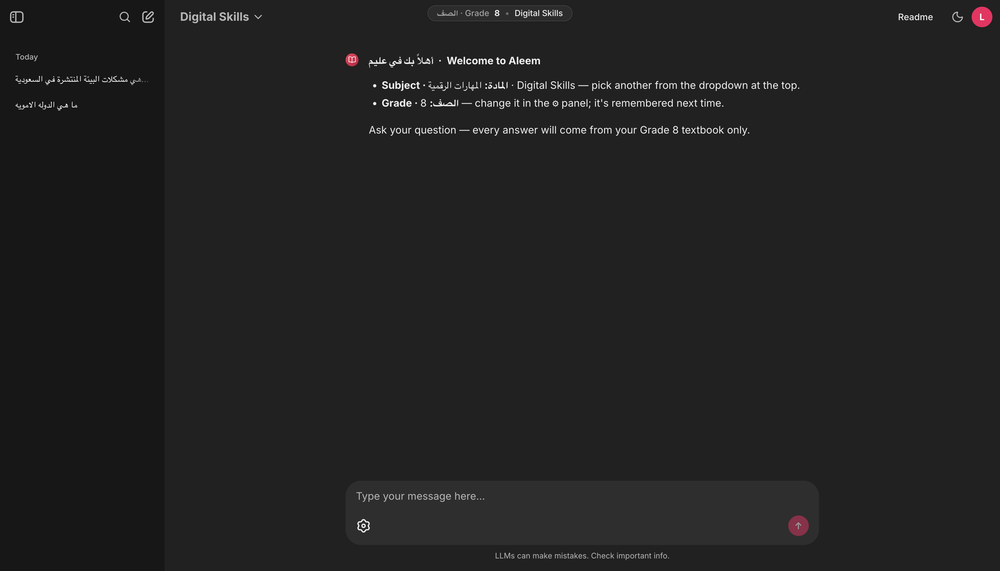
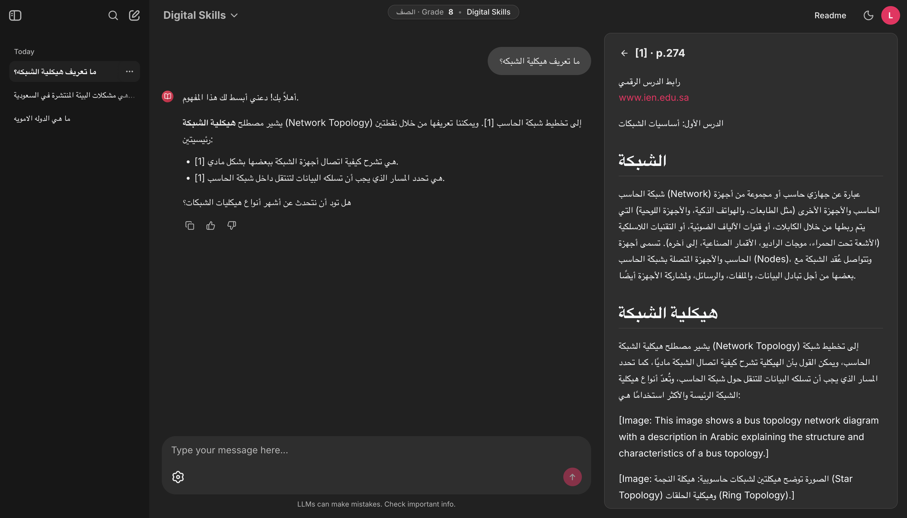
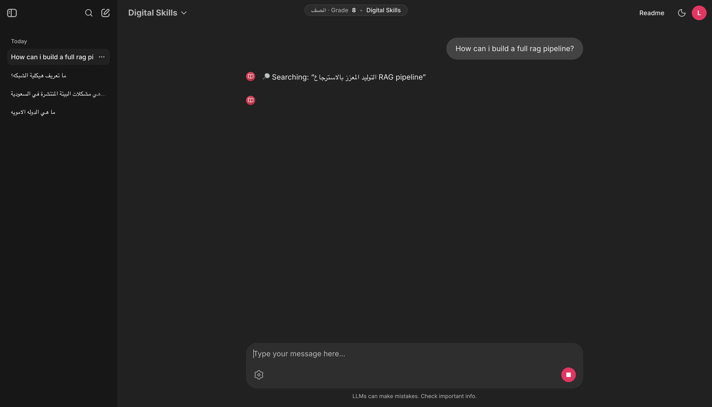
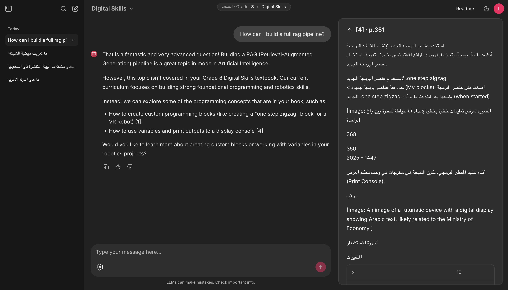
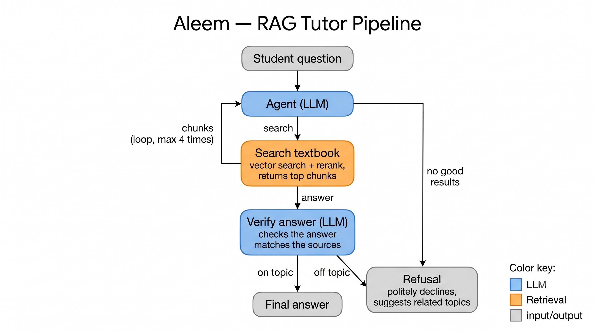

# Aleem — عليم

**A curriculum-grounded RAG tutor for Saudi school students.**

Aleem ("knowledgeable" in Arabic) answers a student's questions using *only* the content of their official Saudi Ministry of Education textbooks. Every answer traces back to a specific lesson and page in the student's grade-level book — and when the textbook doesn't cover the question, Aleem says so instead of inventing an answer.

---

## The problem

Saudi students who use general-purpose LLMs for homework get answers that are *plausible* but *misaligned* with their official curriculum: different terminology than their textbook, examples from foreign curricula, and material from the wrong grade level. That forces them to second-guess every answer — and risks memorizing content that gets marked wrong on national exams.

**Aleem's contract:** if the answer isn't in your textbook, the system tells you — and points you to the lessons in your grade that *are* relevant.

---

## What makes Aleem different

| | Why it matters |
| --- | --- |
| **Grade-isolated retrieval** | A Grade 4 student is *structurally* unable to receive Grade 10 content — each grade has its own vector index. |
| **Grounded by construction** | The corpus is *only* official MoE textbooks from [ien.edu.sa](https://ien.edu.sa). Nothing else. |
| **Lesson-level citations** | Every answer carries inline `[n]` markers linking to the exact lesson, page, and passage. |
| **Refusal as a feature** | When the textbook doesn't cover a question, Aleem refuses politely and surfaces related lessons from the student's grade. |
| **Bilingual** | Ask in Arabic *or* English — Aleem replies in the language you asked, while still retrieving and citing the Arabic textbook. |
| **Model-agnostic** | The generator is a pluggable backend (`fake` / `openrouter` / `ollama`) — swap models without touching the pipeline. |

---

## Screenshots

A walk through one session — Grade 8, *Digital Skills*. Pick a subject, ask in either language, get cited answers, and see refusal in action.

**1. Pick a subject and grade.** Each grade has its own textbook index, so retrieval is scoped from the very first message.



**2. Ask in Arabic — get a cited answer.** Inline numbered markers link to the exact page; the side card shows the source passage and its `ien.edu.sa` origin.



**3. Ask in English — Aleem still searches the Arabic textbook.** The "Searching:" card shows the agent querying the source material in Arabic, regardless of the question's language.



**4. Off-curriculum? Aleem refuses — in your language.** Building a RAG pipeline isn't in the Grade 8 book, so Aleem declines **in English** and redirects to lessons that *are* covered.



---

## How it works

One tool-calling agent, one tool, two post-hoc safety layers. Shape locked in `docs/WORKFLOW_SANDBOX.md`. The student picks a subject (Chainlit chat profile) and grade (⚙ setting); retrieval is scoped to that grade's index.



*The agent loops — search, read, search again (up to 4×) — then a verifier checks the answer against its sources before it ships. If nothing in the textbook supports it, or the answer drifts off-topic, Aleem refuses and suggests related lessons instead.*

The exact pipeline:

```
question + subject + grade + chat history
  ↓
Tool-calling agent  (LangGraph create_react_agent, looped, max 4 retrieve calls)
  • Tutor over Saudi MoE textbooks; cite every claim [n]; answer ONLY from
    retrieved chunks; refuse in its own voice when the chunks don't cover it.
  • Tool: retrieve(query) → Chroma top-20 → Jina rerank top-5
  ↓
Streamed answer with inline [n] markers
  ↓
Layer 2 — Citation parse:   structural check (out-of-range / missing [n]); flagged, never silently repaired.
Layer 3 — Topical verifier: one structured-output LLM call ("is this answer about a topic the
                            chunks actually discuss?"); on off-topic → refuse + topic suggestions.
  ↓
Chainlit renders the answer + side citation cards   →   JSONL log (tool calls, flags, verdict, scores, latency)
```

See `docs/WORKFLOW_SANDBOX.md` for the full design (§3 diagram, §4 safety model, §12 eval bar). `docs/RESPONSE_WORKFLOW.md` preserves the earlier two-graph pipeline as a historical baseline.

---

## Stack

| Layer | Choice |
| --- | --- |
| **OCR** | [Mistral OCR](https://docs.mistral.ai/studio-api/document-processing/basic_ocr/) — hosted, Arabic-capable, with image annotation |
| **Embeddings** | [jina-embeddings-v4](https://huggingface.co/jinaai/jina-embeddings-v4) — multilingual, multimodal, long-context |
| **Vector store** | [Chroma](https://www.trychroma.com/) — one collection per grade |
| **Reranker** | [jina-reranker-v2-base-multilingual](https://huggingface.co/jinaai/jina-reranker-v2-base-multilingual) |
| **Generator** | Pluggable via OpenRouter / Ollama (current default: `gemini-3.1-pro-preview`); any tool-calling model works |
| **Orchestration** | [LangGraph](https://langchain-ai.github.io/langgraph/) `create_react_agent` |
| **UI** | [Chainlit](https://chainlit.io/) with RTL Arabic layout; transcripts persist locally in SQLite |

---

## Scope

**Loaded today:** Grade 8, 4 textbooks. The architecture is per-grade by design (one Chroma collection per grade), so adding Grades 4, 7, 10 and beyond is an ingestion step, not a redesign.
**Subjects:** Arabic, Islamic studies, social studies, English, Math (Math pending OCR-quality validation).
**Out of scope for now:** diagram understanding, equation LaTeX rendering, multi-tenant accounts.

**Data:** official MoE textbooks from [ien.edu.sa](https://ien.edu.sa) and [moe.gov.sa](https://moe.gov.sa), used strictly for non-commercial academic research under the MoE's educational-use terms. Bundled with the repo for reproducibility; recipients must not redistribute further.

---

## Getting started

The full agent path (agent loop → retrieve → citation parse → topical verifier) is built and tested. The only stub is `retrieve()`'s fallback, which returns 3 canned chunks when a grade's Chroma collection is empty — so you can run the whole pipeline end-to-end with **no API key** (`backend: fake`, the shipped default) or with a real LLM (`backend: openrouter`).

### Prerequisites

- **Docker** (Desktop, or `colima` + `docker-compose`) and **`just`** (`brew install just`) — the primary, supported path. Python and all deps live inside the image.
- **git**, and ~5 GB free disk (the torch + Jina model caches dominate).
- *(Optional)* an `OPENROUTER_API_KEY` for real LLM answers — not needed for the default `fake` backend.
- *(Bare-metal only)* **`uv`** (`brew install uv`) if you skip Docker.

### Setup — Docker (recommended)

```bash
git clone <repo-url> Aleem && cd Aleem
cp .env.example .env                 # 1. then set CHAINLIT_AUTH_SECRET (openssl rand -hex 32)
just build                           # 2. build the image (~3–5 min first time, cached after)
just init                            # 3. create the per-grade Chroma collections (one-time)
just up                              # 4. start the UI → http://localhost:8000
just test                            # 5. (optional) ~65 tests in the container
```

### Setup — bare-metal with uv (fallback)

```bash
git clone <repo-url> Aleem && cd Aleem
uv sync                                                          # install deps into .venv
cp .env.example .env                                            # set CHAINLIT_AUTH_SECRET
uv run python -m src.retrieval.init_chroma                      # create collections
uv run python scripts/smoke_run.py "what is photosynthesis?"    # agent end-to-end, no UI, no key
just dev                                                        # or: (cd src/ui && PYTHONPATH=../.. uv run chainlit run app.py)
uv run pytest                                                   # ~4s
```

To use a real LLM, add `OPENROUTER_API_KEY` to `.env`, set `backend: openrouter` in `config.yaml`, and `just restart`. Full step-by-step — prerequisites, switching backends, persistent chat history, troubleshooting — is in **[`SETUP.md`](SETUP.md)**.

---

## Repository layout

```
Aleem/
├── README.md              You are here — the project pitch
├── SETUP.md               Install + run, from a fresh clone
├── BUILD_SPEC.md          Locked design decisions (§1–§10)
├── CLAUDE.md / AGENTS.md  Repo map for coding agents
├── config.yaml            LLM backend + agent + verifier config
├── justfile               Task runner (just build / init / up / test …)
├── Dockerfile             docker-compose.yml — the container build
├── docs/                  Design docs (WORKFLOW_SANDBOX, RESPONSE_WORKFLOW, OCR) + assets/ screenshots
├── prompts/               Jinja templates: agent.j2 + verifier.j2
├── scripts/               smoke_run.py (agent end-to-end, no UI)
├── src/
│   ├── retrieval/         Jina-v4 embedder + Chroma client
│   ├── graph/             Tool-calling agent: agent.py, tools.py, verifier.py, parse.py
│   ├── ingest/            OCR → chunking → embedding pipeline
│   └── ui/                Chainlit app (tool-call cards + token stream)
├── tests/                 pytest suite (fake backend)
├── chroma/                Persisted per-grade Chroma collections
└── Data/                  Raw textbook PDFs (gitignored)
```

---

## Evaluation

- **Demo smoke set (60 questions):** 70% authored from end-of-chapter exercises (gold answer + source page), 20% should-refuse off-curriculum questions, 10% adversarial bilingual cases.
- **Metrics:** retrieval Recall@5, refusal precision/recall, manual faithfulness review.
- **Benchmark phase (post-demo):** publish a 150–300-question gold set as a HuggingFace dataset; run an embedding and generator bake-off plus the full RAGAS suite.

---

## Roadmap

- [x] **Phase 0 — Grade 8:** end-to-end Chainlit app over Grade 8 (4 textbooks) with grade-isolated retrieval, lesson-level citations, and refusal.
- [ ] **Phase 1 — More grades:** ingest Grades 4, 7, 10 and additional subjects.
- [ ] **Phase 2 — Benchmark:** publish the eval set; run embedding + generator bake-offs.
- [ ] **Phase 3 — Multimodal:** retrieve textbook diagrams via Jina-v4 image embeddings; LaTeX-aware math OCR.
- [ ] **Phase 4 — Pilot:** classroom testing with a Saudi school.

---

## License & use

- **Code:** TBD (likely MIT or Apache 2.0).
- **Textbook content:** © Ministry of Education, Kingdom of Saudi Arabia. Used strictly for non-commercial academic research under the MoE's educational-use terms; not for redistribution. Any deployment beyond this capstone requires explicit MoE permission.

## Acknowledgments

Ministry of Education (textbook source) · [Mistral AI](https://mistral.ai/) (OCR) · [Jina AI](https://jina.ai/) (embeddings + reranker) · the Applied AI Bootcamp. Capstone project, built by a team of 2.
